<div align="center">

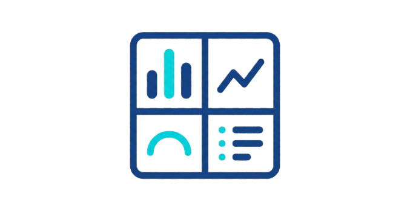

# DashForge

## Your Plotly charts deserve a dashboard—not hours of dashboard work.

### Turn your charts into a complete, interactive dashboard in just a few lines of Python.

No HTML. No CSS. No JavaScript. Just add your charts, run your code, and let
DashForge handle the dashboard around them.

[Why DashForge?](#why-dashforge) · [Quick start](#quick-start) · [Gallery](#gallery) · [Examples](#example-dashboards) · [Documentation](#documentation)

</div>

<p align="center">
  
</p>

---

## Why DashForge?

You have already done the important work: exploring the data and creating the
charts. The last thing you should need is another long project just to place
those charts on a page.

DashForge turns a group of Plotly figures into one interactive dashboard in
seconds. Instead of moving between separate charts, rebuilding layouts for a
client, or learning front-end tools just to present your analysis, you can keep
working in Python and focus on the insight.

It is for analysts and developers who want their work to look complete quickly:
one place for every chart, one dashboard to share, and a clean Python workflow
from start to finish.

Full dashboard frameworks solve a different problem. They are built for
applications — callbacks, reactive state, component trees you assemble by
hand — which is the right amount of structure when people will click through
your app and change what it shows. It is a lot to learn, though, when all you
want is for the charts you already made to look finished on a page. DashForge
does not ask you to learn any of that. There is no reactive model, no
callback graph, and no layout tree to build — just a small set of functions
that do exactly what their names say, so a line like `add_kpi(...)` tells you
what it does before you ever open the docs.

## Why choose DashForge?

- **Build fast** — turn multiple Plotly charts into a dashboard in a few lines.
- **Skip the framework** — no callbacks, reactive re-runs, or component trees to learn first.
- **Stay in Python** — no HTML, CSS, or JavaScript knowledge required.
- **Present better** — keep related charts, KPIs, and data together in one clear view.
- **Avoid the setup work** — DashForge handles the dashboard structure so you do not have to build it from scratch.
- **Make it yours** — choose themes, colors, layouts, titles, footers, and more.
- **Keep it interactive** — your Plotly charts stay interactive inside the dashboard.

## Highlights

- Pure Python API
- Small, self-explanatory function set — no framework to learn first
- Interactive dashboard experience
- Built-in dark and light themes
- Full color customization
- KPI cards
- Dataset viewer page
- Automatic chart layouts
- Adjustable chart sizes
- Control over charts per row
- Custom chart titles and subtitles
- Optional maximize view for each chart
- Custom logo, header, footer, and timestamp support
- Open source

## Setup

Install DashForge from your terminal:

```bash
pip install Dashforge
```

**PyPI:** <!-- Paste the PyPI library link here when it is ready. -->

## Quick start

Start with the Plotly figures you have already made:

```python
fig1 = ...  # Your Plotly figure
fig2 = ...
fig3 = ...
fig4 = ...
fig5 = ...
fig6 = ...
```

Then turn them into a dashboard:

```python
from dashforge import Dashboard

dashboard = Dashboard()
dashboard.add_chart([fig1, fig2, fig3, fig4, fig5, fig6])
dashboard.build_dashboard()
dashboard.run()
```

### Output

<p align="center">
  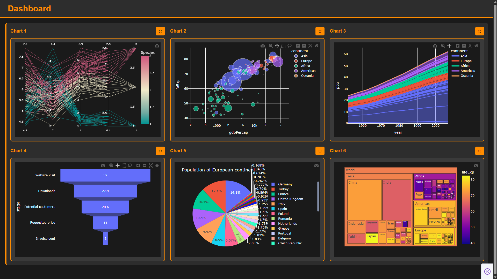
</p>

## More than a chart grid

DashForge is built to help a dashboard feel finished, not just display figures
next to each other. Add KPI cards to surface the numbers that matter most. Add
a data-table page when people need to inspect the source. Choose an automatic
layout when speed matters, or control chart rows and sizes when the story needs
a specific design — each still a single, plainly named function call. **Layout
6** in the [Gallery](#gallery) below shows how far a theme, a KPI row, and a
custom chart grid can take the same simple pattern.

You can also set chart titles and subtitles, choose which charts can be
maximized, switch between dark and light themes, customize every important
color, and add a logo, footer, or timestamp for a more complete delivery.

## Gallery

Here are a few ways DashForge dashboards can look. Alternate views are paired
side by side; single layouts are shown at full width.

<p align="center">
  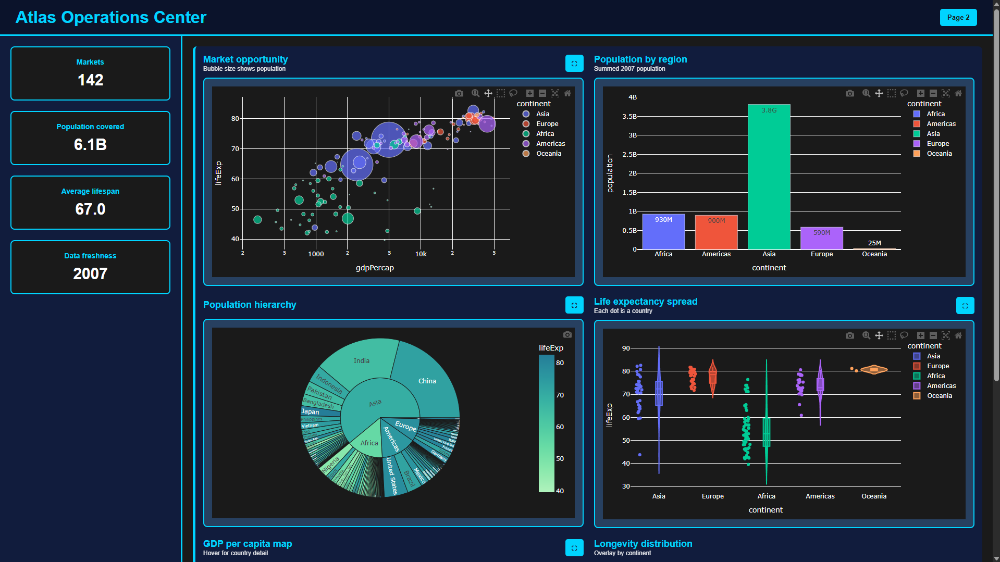
  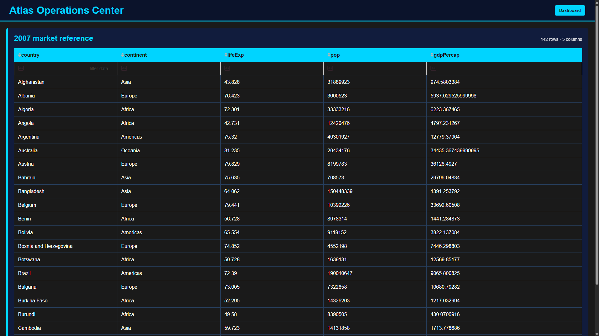
</p>

<p align="center">
  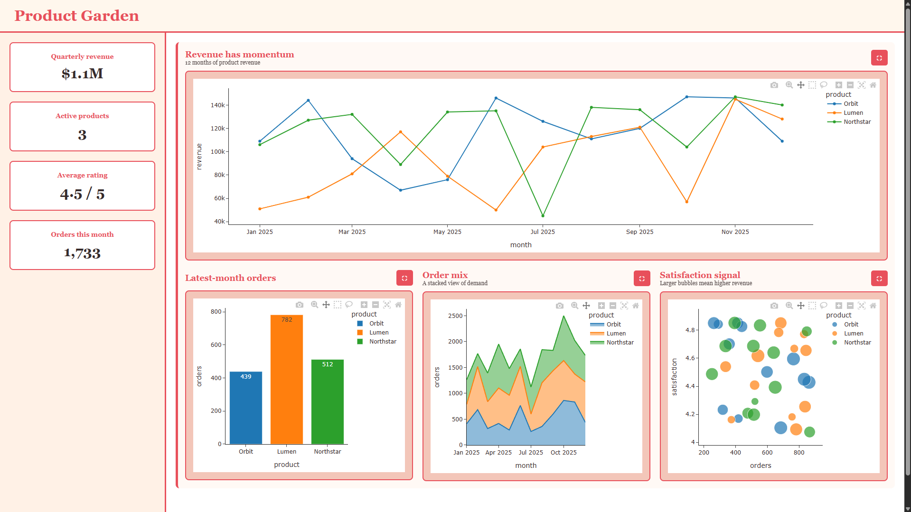
</p>

<p align="center">
  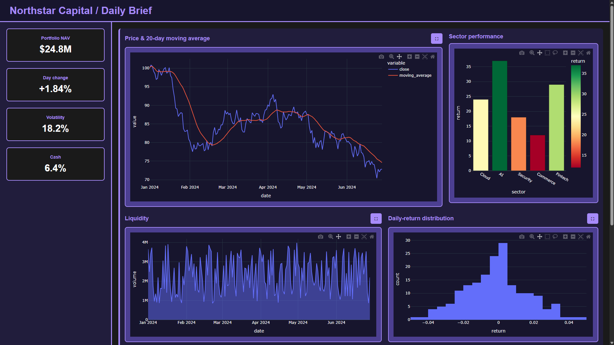
  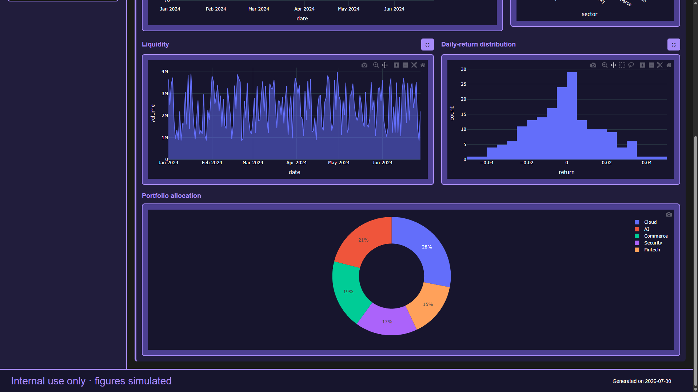
</p>

<p align="center">
  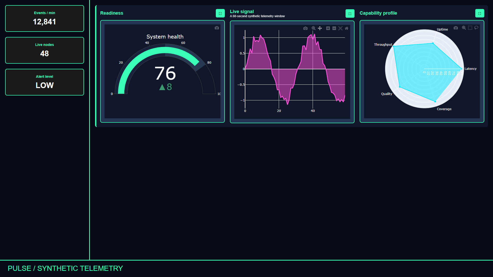
</p>

<p align="center">
  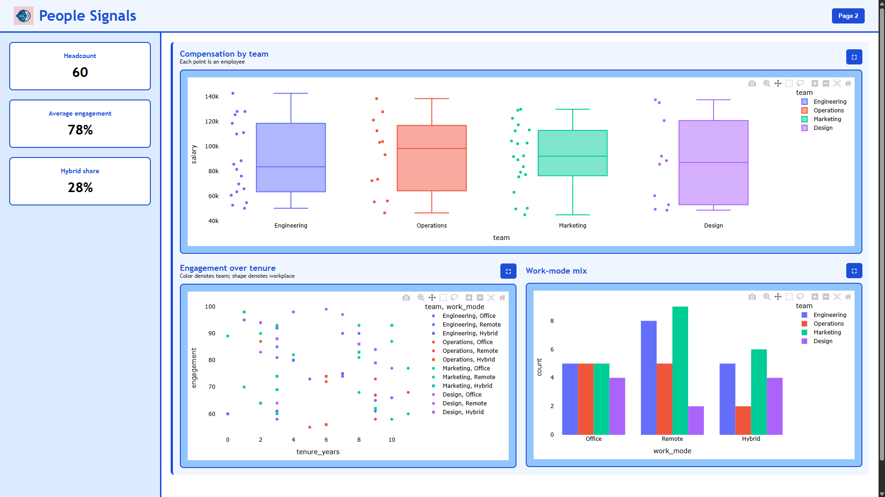
  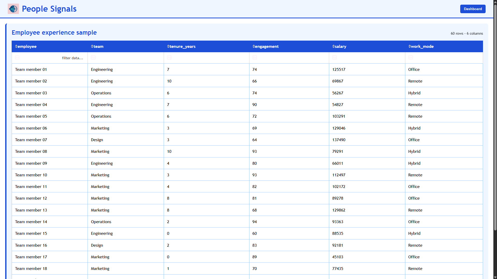
</p>

<p align="center">
  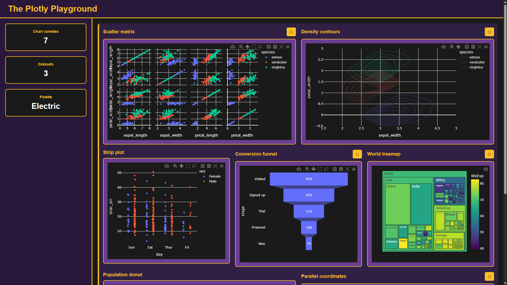
  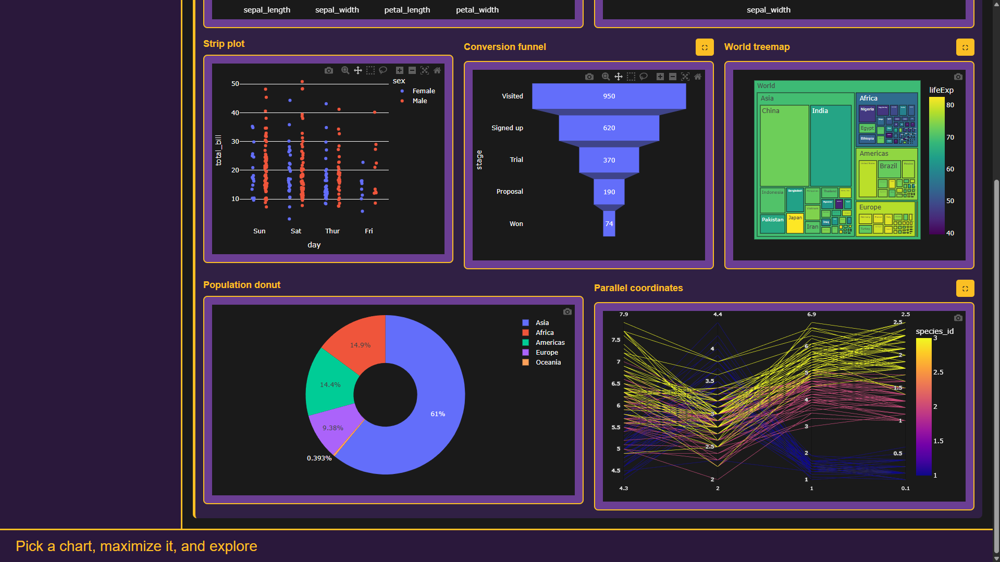
</p>

<p align="center">
  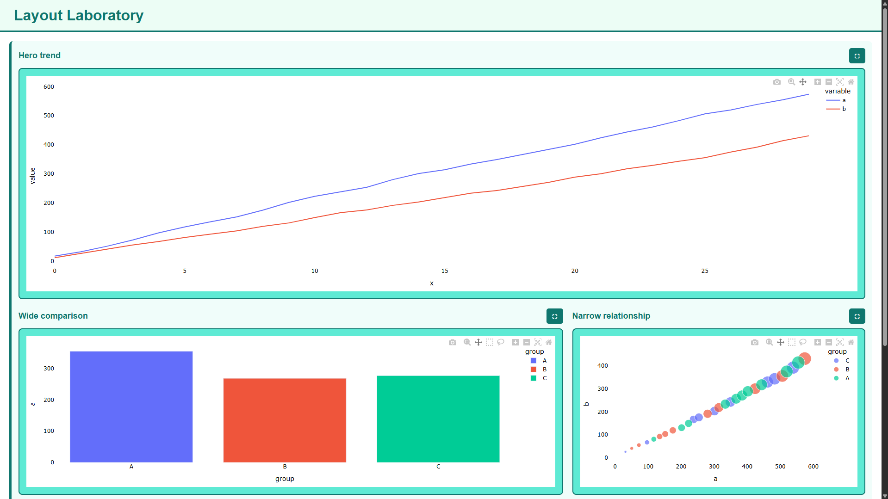
  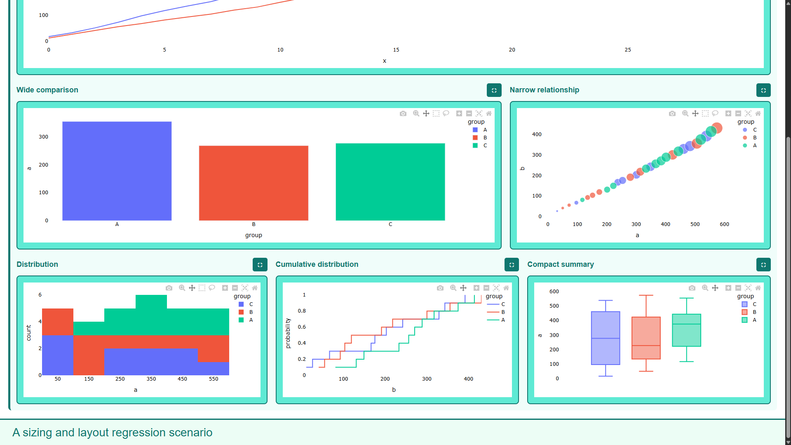
</p>

## Example dashboards

Want to see DashForge pushed in different directions? The repository includes
ready-to-run examples with different color palettes, chart combinations,
dashboard styles, KPI setups, dataset views, and layouts.

Browse the [example dashboard collection](TestCases/README.md), then run any
scenario from the project root:

```powershell
python TestCases/01_dark_command_center.py
```

## Roadmap

The current focus is a simple, expressive dashboard-building workflow, and
that stays the standard for what comes next: every new capability will be one
function with a clear name, not a new concept to learn. Ideas being explored
for future versions include:

- Custom filters for charts
- Multiple dashboard pages
- Text boxes that can sit alongside charts
- Saved design settings for faster reuse
- More upcoming Layouts

## Contributing

Ideas, bug reports, and pull requests are welcome. If something feels missing,
something breaks, or you have an idea that would make DashForge more useful,
please share it.

---

<div align="center">

### Enjoying DashForge?

If it saved you time, consider giving the repository a star and sharing it with
another developer or analyst who could use a faster way to build dashboards.

</div>

## Documentation

The full documentation website will cover every feature and show how to get the
most out of DashForge.

**Documentation website:** <!-- Paste the documentation website link here when it is ready. -->

## License

<!-- Add the license name and link to the LICENSE file here when they are ready. -->